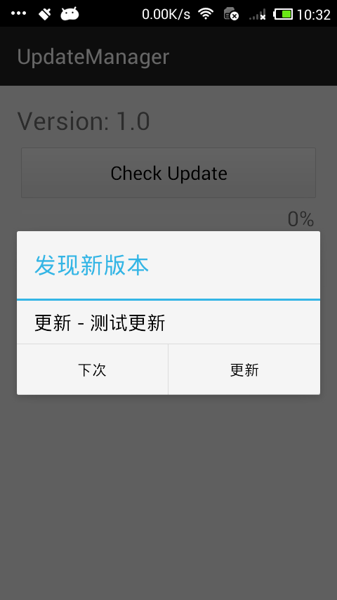

## Android-UpdateManager

通过单一的类`Updater`可以方便的实现自动检查更新、下载安装包和自动安装，可以监听下载进度。保存路径可以自由书写，如果路径中某个目录不存在会自动创建，流式API接口易于使用。

下面是使用示例，一行代码搞定自动更新：

```
String savePath = Environment.getExternalStorageDirectory() 
                    + "/whinc/download/whinc.apk";
String updateUrl = "http://192.168.1.168:8000/update.xml";
Updater.with(mContext)
        .downloadListener(mListener)
        .update(updateUrl)
        .save(savePath)
        .create()
        .checkUpdate();
```



### LICENSE

The MIT License (MIT)

Copyright (c) 2015 WuHui

Permission is hereby granted, free of charge, to any person obtaining a copy
of this software and associated documentation files (the "Software"), to deal
in the Software without restriction, including without limitation the rights
to use, copy, modify, merge, publish, distribute, sublicense, and/or sell
copies of the Software, and to permit persons to whom the Software is
furnished to do so, subject to the following conditions:

The above copyright notice and this permission notice shall be included in all
copies or substantial portions of the Software.

THE SOFTWARE IS PROVIDED "AS IS", WITHOUT WARRANTY OF ANY KIND, EXPRESS OR
IMPLIED, INCLUDING BUT NOT LIMITED TO THE WARRANTIES OF MERCHANTABILITY,
FITNESS FOR A PARTICULAR PURPOSE AND NONINFRINGEMENT. IN NO EVENT SHALL THE
AUTHORS OR COPYRIGHT HOLDERS BE LIABLE FOR ANY CLAIM, DAMAGES OR OTHER
LIABILITY, WHETHER IN AN ACTION OF CONTRACT, TORT OR OTHERWISE, ARISING FROM,
OUT OF OR IN CONNECTION WITH THE SOFTWARE OR THE USE OR OTHER DEALINGS IN THE
SOFTWARE.
